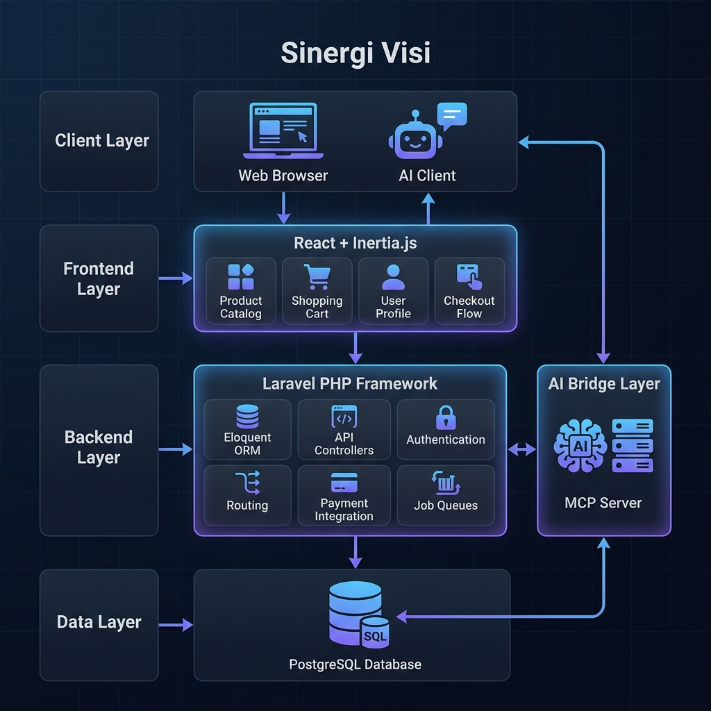
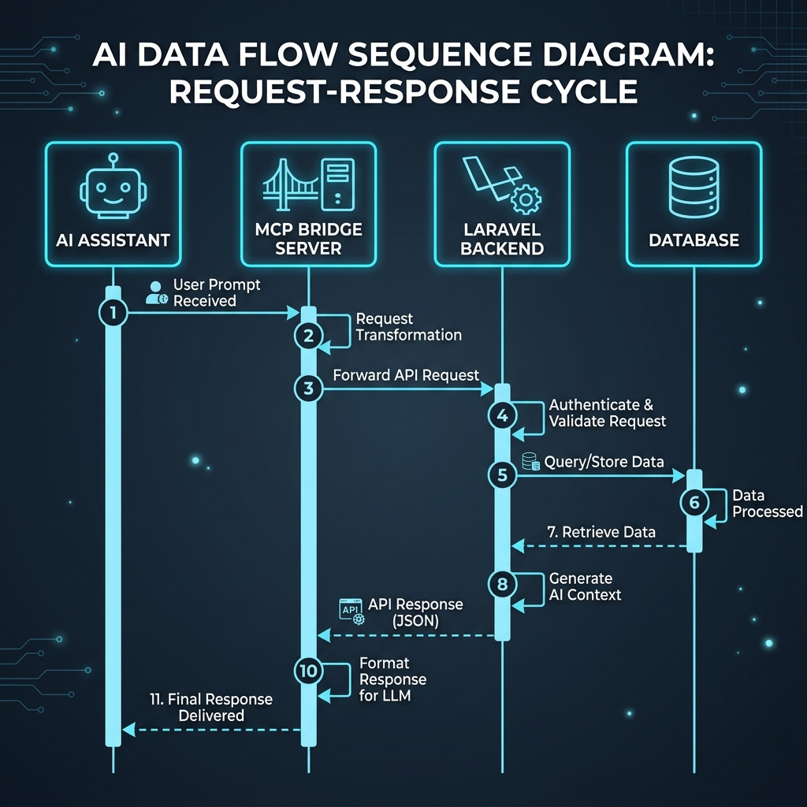

# Software Architecture: Sinergi Visi Ecommerce

Dokumen ini menjelaskan struktur arsitektur, tumpukan teknologi (tech stack), dan aliran data dari proyek **Sinergi Visi Ecommerce**.

## 1. Tinjauan Sistem (System Overview)

Sinergi Visi Ecommerce adalah platform perdagangan elektronik modern yang dibangun dengan arsitektur **Monolith (Hybrid)**. Aplikasi ini menggunakan Laravel sebagai inti (core) backend dan React sebagai layer frontend melalui Inertia.js. Selain itu, sistem ini memiliki integrasi AI melalui **Model Context Protocol (MCP)**.

### Diagram Arsitektur Utama


---

## 2. Tumpukan Teknologi (Technology Stack)

| Layer | Teknologi | Deskripsi |
| :--- | :--- | :--- |
| **Backend** | PHP 8.3 + Laravel 13 | Framework utama untuk logika bisnis dan API. |
| **Frontend** | React 18 + Inertia.js | Render sisi client dengan pengalaman Single Page Application (SPA). |
| **Styling** | Tailwind CSS | Framework CSS berbasis utility untuk UI yang responsif. |
| **Database** | PostgreSQL | Database relasional untuk penyimpanan data utama. |
| **AI Protocol** | Model Context Protocol (MCP) | Protokol untuk menghubungkan AI dengan data sistem. |
| **Tooling** | Vite, Composer, NPM | Manajemen dependensi dan build sistem. |
| **Container** | Docker | Untuk standarisasi lingkungan deployment. |

---

## 3. Integrasi AI (MCP Bridge)

Salah satu fitur unik dari sistem ini adalah **Sinergi Visi MCP Bridge**. Ini memungkinkan asisten AI (seperti Claude) untuk berinteraksi langsung dengan database ecommerce (produk, pesanan, dan klaim).

### Aliran Data AI


**Tools yang tersedia di MCP:**
- `get_products`: Mengambil katalog produk.
- `get_orders`: Melihat daftar pesanan (khusus admin).
- `get_order_details`: Melihat detail pesanan spesifik.
- `submit_claim`: Mendaftarkan klaim kerusakan barang baru.

---

## 4. Struktur Direktori Utama

```text
├── app/                  # Logika Backend (PHP)
│   ├── Http/Controllers/ # Endpoint Web & API
│   ├── Models/           # Struktur Database (Eloquent)
│   └── Middleware/       # Keamanan & Auth (termasuk McpAuth)
├── mcp-server/           # Node.js Bridge untuk integrasi AI
│   └── index.js          # Definisi Tools MCP
├── resources/js/         # Logika Frontend (React)
│   ├── Pages/            # Halaman utama (Home, Product, Checkout)
│   └── Components/       # Komponen UI reusable
├── routes/               # Definisi Route
│   ├── web.php           # Rute untuk Browser (Inertia)
│   └── api.php           # Rute untuk MCP & API External
├── database/             # Migrasi & Seeder Database
└── Dockerfile            # Konfigurasi Deployment
```

---

## 5. Keamanan & Autentikasi

1.  **Web Auth**: Menggunakan **Laravel Breeze/Sanctum** untuk manajemen sesi user dan seller.
2.  **MCP Auth**: Menggunakan middleware kustom `McpAuthMiddleware` yang memvalidasi header `X-MCP-Token`. Token ini dikonfigurasi di file `.env`.
3.  **Authorization**: Menggunakan Laravel Gates/Policies (misal: `can:seller`) untuk membatasi akses fitur admin.

---

## 6. Alur Kerja Deployment

Aplikasi ini dirancang untuk dijalankan dalam container.
- **Development**: Menggunakan `php artisan serve` dan `npm run dev` secara bersamaan (via `concurrently`).
- **Production**:
    1. Build aset frontend via Vite (`npm run build`).
    2. Jalankan migrasi database.
    3. Jalankan server Laravel (Octane/Swoole atau PHP-FPM).
    4. Jalankan MCP Server jika integrasi AI diperlukan.
