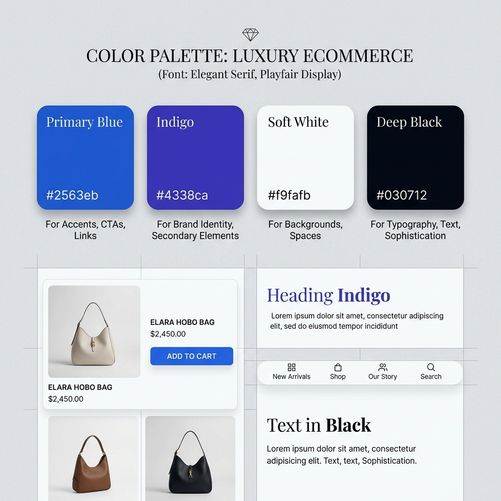

# UI Design System: Sinergi Visi Ecommerce

Dokumen ini mendefinisikan standar desain, token visual, dan komponen antarmuka untuk proyek **Sinergi Visi Ecommerce**. Sistem ini dirancang untuk menciptakan pengalaman pengguna yang **Premium, Modern, dan Elegan**.

---

## 1. Identitas Visual (Visual Identity)

### 1.1 Prinsip Desain
*   **Premium Aesthetics**: Penggunaan whitespace yang luas, tipografi yang kuat, dan gradien yang halus.
*   **Trustworthy**: Dominasi warna biru untuk membangun kepercayaan.
*   **Dynamic**: Interaksi mikro dan transisi yang halus.

---

## 2. Token Visual (Design Tokens)

### 2.1 Palet Warna

| Preview | Nama | Nilai (Tailwind) | HEX | Kegunaan |
| :--- | :--- | :--- | :--- | :--- |
| 

 | **Primary Blue** | `blue-600` | `#2563eb` | CTA Utama, Links, Aksèn. |
| 

 | **Primary Indigo** | `indigo-700` | `#4338ca` | Gradien, Identitas Brand. |
| 

 | **Light Background** | `gray-50` | `#f9fafb` | Latar belakang Light Mode. |
| 

 | **Dark Background** | `gray-950` | `#030712` | Latar belakang Dark Mode. |
| 

 | **Accent Yellow** | `yellow-400` | `#facc15` | Rating, Ikon, Highlight. |

---

## 3. Tipografi

*   **Font Family**: `Figtree` (Sans-serif)
*   **Headings**:
    *   **Hero Title**: `text-7xl`, `font-black`, `tracking-tight` (Gradient)
    *   **Section Title**: `text-4xl`, `font-black`
*   **Body**: `text-base`, `leading-relaxed`, `text-gray-600` (Light) / `text-gray-400` (Dark)

---

## 4. Komponen (Components)

### 4.1 Buttons
*   **Premium Button**: `rounded-2xl`, `bg-blue-600`, `shadow-lg shadow-blue-500/30`.
*   **Secondary Button**: `rounded-xl`, `bg-gray-100`, `hover:bg-gray-200`.

### 4.2 Cards
*   **Standard Card**: `rounded-2xl`, `bg-white`, `shadow-md`, `hover:-translate-y-2`.
*   **Category Card**: `aspect-square`, `overflow-hidden`, `group-hover:scale-110`.

---

## 5. Ilustrasi & Aset
*   **Logos**: Gradien `from-blue-600 to-indigo-700`.
*   **Shadows**: Gunakan colored shadows untuk elemen interaktif (`shadow-blue-500/30`).
*   **Icons**: Stroke width `2`, rounded caps, warna `blue-600`.
