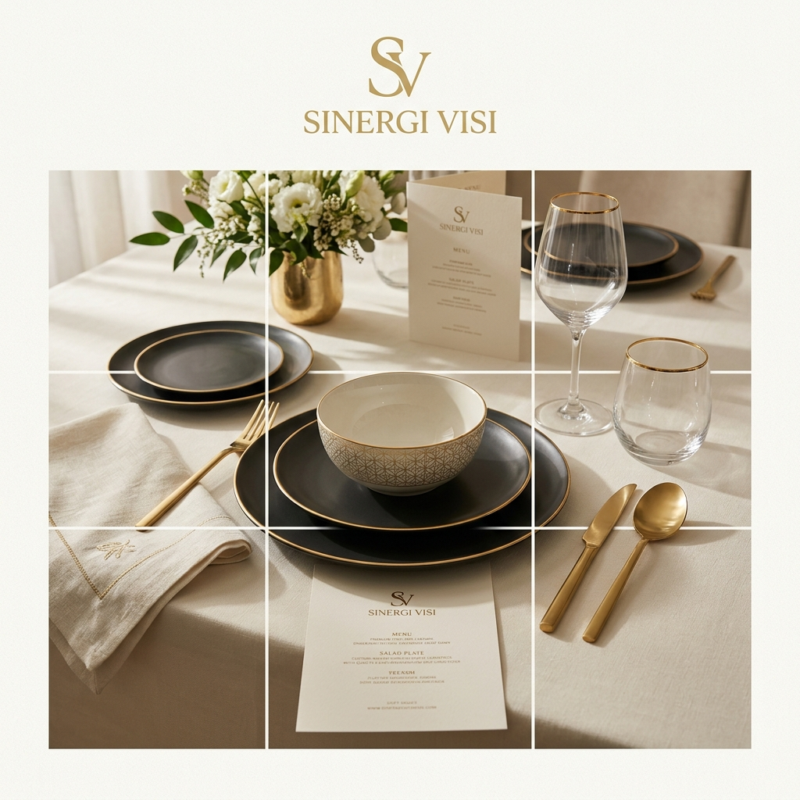

# UI Design System: Sinergi Visi Ecommerce (Luxury Brand Rebuilt)

Dokumen ini mendefinisikan standar desain, token visual, dan komponen antarmuka untuk proyek **Sinergi Visi Ecommerce** setelah peluncuran identitas visual logo baru. Sistem ini dirancang untuk mencerminkan filosofi **Luxury Tableware (Fine Glassware & Ceramics)** dengan memadukan keanggunan, kekuatan, dan presisi.

---

## 1. Filosofi & Visi Identitas Baru (Brand Identity)

### 1.1 Analisis Logo Baru
Logo baru **Sinergi Visi** menggambarkan garis monoline emas yang membentuk siluet gelas anggur (*glassware*) dan piring makan (*ceramics*) yang saling berpotongan secara harmonis di dalam lingkaran presisi. 
*   **Gelas Anggur (Glassware)**: Melambangkan transparansi, kejernihan, kecemerlangan, dan estetika modern.
*   **Piring (Ceramics)**: Melambangkan bumi (tanah liat), kekuatan, kehangatan rumah, ketahanan, dan keahlian tangan (craftsmanship).
*   **Sinergi Lingkaran**: Keutuhan layanan, kontinuitas kualitas, dan visi global dalam menghadirkan seni meja makan mewah bertaraf internasional.

### 1.2 Visi & Misi Luxury Ecommerce
*   **Visi**: Menjadi kurator utama untuk perlengkapan meja makan premium di Indonesia, mengubah setiap momen bersantap menjadi pengalaman seni yang mewah.
*   **Misi**:
    *   Menghadirkan produk pecah belah kelas dunia dengan standar kualitas tanpa kompromi.
    *   Menawarkan pengalaman belanja digital yang intuitif, aman, dan berkelas tinggi.
    *   Mendukung gaya hidup modern melalui kurasi produk yang memadukan keindahan visual dengan kegunaan praktis.

---

## 2. Token Visual Premium (Design Tokens)

### 2.1 Palet Warna (Brand Colors)
Menghilangkan warna biru/indigo kasual dan beralih ke warna-warna bumi yang hangat, emas prestisius, dan warna gelap berkelas warisan (*heritage*).

| Preview | Nama Warna | Nilai (Tailwind) | HEX | Peran & Deskripsi |
| :--- | :--- | :--- | :--- | :--- |
| 

 | **Sinergi Gold** | `amber-500` / kustom | `#C5A85A` | **Primary Accent**: Digunakan untuk CTA utama, lencana produk premium, bintang rating, dan aksen penting. |
| 

 | **Deep Bronze** | `amber-700` / kustom | `#8E753B` | **Secondary/Hover State**: Digunakan untuk state interaktif (hover/active) tombol emas, teks sub-heading tertentu. |
| 

 | **Alabaster Ivory** | `stone-50` / kustom | `#FAF9F5` | **Light Background**: Warna putih hangat bersih seperti porselen berkualitas tinggi untuk latar belakang halaman utama. |
| 

 | **Champagne Sand** | `stone-100` / kustom | `#F3F1EB` | **Neutral Light**: Digunakan untuk pemisah seksi halaman, kartu sekunder, dan bayangan lembut. |
| 

 | **Obsidian Charcoal** | `stone-950` / kustom | `#1C1C1A` | **Dark Theme/Text**: Warna charcoal gelap yang hangat untuk teks utama, tombol kontras tinggi, dan background Dark Mode. |
| 

 | **Warm Stone** | `stone-500` | `#78716C` | **Muted Text**: Untuk teks deskripsi sekunder, keterangan hak cipta, dan informasi yang tidak menonjol. |

### 2.2 Tipografi Klasik-Modern (Typography)
Tipografi harus mencerminkan dualitas logo: serif klasik berpadu dengan sans-serif modern.

*   **Display & Headings (Serif)**:
    *   Menggunakan font **Cormorant Garamond**, **Playfair Display**, atau **Cinzel** untuk memberikan nuansa editorial mewah.
    *   *Penerapan*: Judul Hero, Nama Produk Utama, Judul Seksi Halaman.
*   **Body & UI Text (Sans-Serif)**:
    *   Menggunakan **Figtree** atau **Inter** untuk keterbacaan tinggi di layar digital.
    *   *Penerapan*: Tombol navigasi, deskripsi produk, teks formulir, teks footer sekunder.
*   **Subtitles & Metadata**:
    *   Teks uppercase dengan *letter-spacing* yang lebar (`tracking-widest` atau `tracking-double`). Contoh: `text-xs font-semibold tracking-widest uppercase`.

### 2.3 Spacing & Borders
*   **Container Width**: Maksimal `max-w-7xl` untuk tata letak desktop yang elegan dan seimbang.
*   **Border Radius**:
    *   Komponen Tajam/Minimalis: `rounded-none` atau `rounded-sm` (opsional untuk kesan butik eksklusif).
    *   Komponen Melengkung Lembut: `rounded-2xl` s/d `rounded-3xl` untuk kartu kategori dan kontainer visual besar.
*   **Borders & Dividers**: Garis tipis 1px berwarna `#EAE8E2` (Light) atau `#2E2E2C` (Dark).

---

## 3. Komponen Antarmuka (UI Components)

### 3.1 Buttons (Tombol)
*   **Premium Gold Button (Primary)**:
    *   *Normal*: Latar belakang `#C5A85A`, teks putih `#FFFFFF` atau charcoal `#1C1C1A`, transisi halus.
    *   *Hover/Active*: Berubah ke `#8E753B` dengan sedikit efek bayangan redup (*glow*).
*   **Charcoal Accent Button (Secondary)**:
    *   *Normal*: Latar belakang `#1C1C1A`, teks putih `#FFFFFF`.
    *   *Hover*: Latar belakang transparan dengan outline tipis `#1C1C1A`, teks hitam/charcoal.
*   **Text Link Button**:
    *   Gaya monoline tipis di bawah teks, menggunakan `border-b border-stone-400 hover:border-amber-500 transition-colors`.

### 3.2 Cards (Kartu Produk & Kategori)
*   **Luxury Product Card**:
    *   Background warna Alabaster Ivory (`#FAF9F5`).
    *   Border tipis elegan tanpa bayangan berat (gunakan `shadow-sm` atau *border-less*).
    *   Transisi zoom gambar yang halus (`transition-transform duration-700 group-hover:scale-105`).
*   **Category Card**:
    *   Menggunakan foto kurasi bernuansa hangat dengan gradien hitam tipis untuk keterbacaan teks emas di atasnya.

---

## 4. Pola Visual & Animasi (Visual Patterns & Motion)

*   **Micro-interactions**: Efek scale-down ringan pada tombol saat aktif (`active:scale-[0.98]`).
*   **Ambient Glow**: Gunakan bayangan warna emas lembut (`shadow-amber-500/10`) daripada bayangan hitam biasa untuk elemen premium.
*   **Whitespace**: Berikan ruang kosong yang cukup luas di antara bagian halaman (padding minimal `py-24` s/d `py-32`) untuk memberikan "napas" mewah pada konten.
